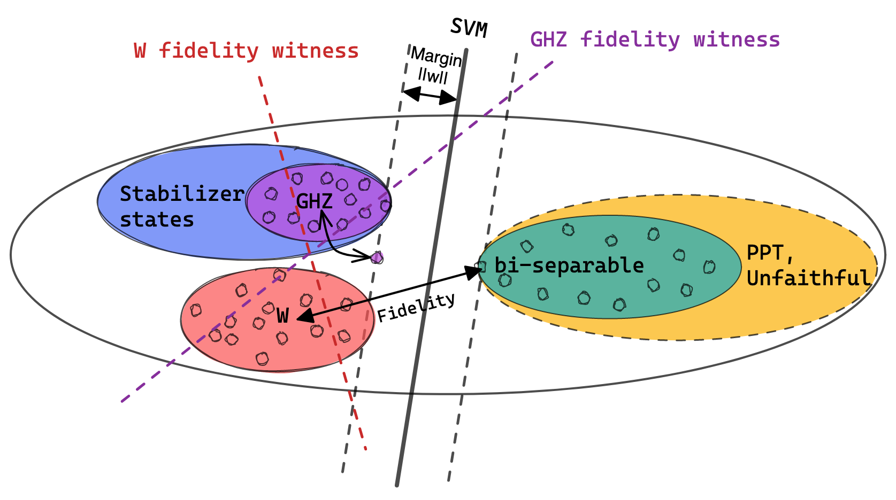

# README

<!-- [Figure](https://excalidraw.com/#json=XBnibVJopP0Gr8kOZ-69F,DMmLNTof7_3ff3TVo4K_0Q) -->
## The Paper
<!-- Entanglement-Witness-by-Quantum -->

`Towards efficient and generic entanglement detection by machine learning`.
Jue Xu and Qi Zhao, 2022,
arXiv: ...
<!-- Entanglement Detection Beyond Measuring Fidelities
M. Weilenmann, B. Dive, D. Trillo, E. A. Aguilar and M. Navascués 
20th December 2019Entanglement Detection Beyond Measuring Fidelities -->

<!-- ####################### INSTALLATION ########################## -->
<!-- ## Installation

The contents of the package do not need any installation beyond the packages required below. -->
<!-- The package can simply be downloaded and run directly.  -->
<!-- Note that the `quantum_state_utils.py` module must be in the same directory as the notebook `Entangle.ipynb` when they are run. -->

## Packages required for numeric simulation: 
- anaconda
- python, version > 3.8.8
- numpy, version > 1.21.5
- matplotlib, version > 3.5.1 
- QuTiP, version > 4.7.0
- Scikit-learn, version > 1.1.2

[QuTiP](https://qutip.org/):
	Installation instructions available at (https://qutip.org/docs/latest/installation)

[Scikit-learn](https://scikit-learn.org/stable/):
	Installation instructions available at (https://scikit-learn.org/stable/install)

Classical shadow: https://github.com/hsinyuan-huang/predicting-quantum-properties

Unfaithful states: https://github.com/BenDive/Entanglement-Detection-Beyond-Measuring-Fidelities

<!-- ######################### USAGE ############################# -->
## Usage of code

[Code](https://github.com/Jue-Xu/Entanglement-Witness/tree/main/Code) folder includes the code supporting the [paper](https://github.com/Jue-Xu/Entanglement-Witness/blob/main/ew.pdf).
The script and notebook are organized as follows. 
[quantum_state_utils.py](https://github.com/Jue-Xu/Entanglement-Witness/blob/main/Code/quantum_state_utils.py) contains the functions that generate specific data (e.g. bi-separable, genuine entangled quantum states) and construct the training/testing datasets. 
The [entangle_detection.ipynb](https://github.com/Jue-Xu/Entanglement-Witness/blob/main/Code/entangle_detection.ipynb) notebook contains the scripts that generates a particular example or a figure.
The `.py` script must be in the same directory as the notebook when they are run.
<!-- Each of the other files have the scripts that correspond to
a particular example, figure, or table in the manuscript, and can be run independently. -->

<!-- ########################## LICENSE ############################ -->
## License

The code here is made available under the Creative Commons Attribution license (CC BY 4.0)
(https://creativecommons.org/licenses/by/4.0/